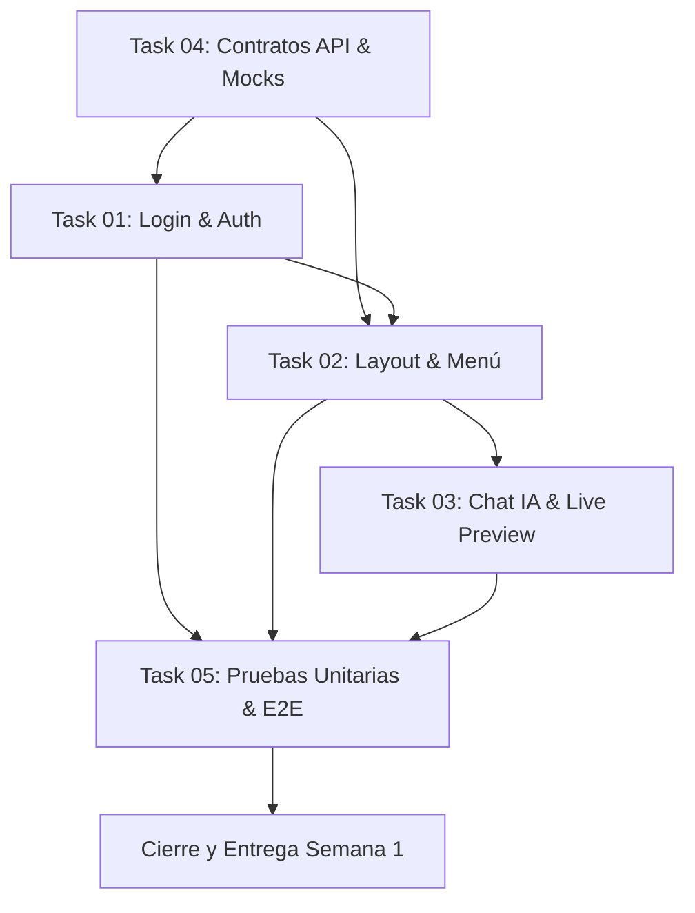

# Semana 1 — Hoja de Ruta & Resumen de Tareas (Versión Beta 21 Días)

> **Sprint:** Semana 1 de 3 (Días 1 a 7 de la Versión Beta Fast-Track)  
> **Objetivo del Sprint:** Construir el núcleo de autenticación, el marco de navegación principal y el editor conversacional insignia con previsualización en vivo (Chat IA + Live Preview).  
> **Estado del Backend:** En desarrollo paralelo (Uso obligatorio de Servicios Mock y contratos API tipados).

---

## 1. Objetivos Estratégicos de la Semana 1

Durante la primera semana del plan Fast-Track (21 días), el equipo de frontend debe entregar los tres pilares fundamentales de la experiencia de usuario:

```text
┌─────────────────────────────────────────────────────────────────────────────┐
│                       ENTREGABLES DE LA SEMANA 1                            │
├───────────────────────────────┬─────────────────────────────────────────────┤
│ 1. Módulo de Autenticación    │ • Pantalla de Login limpio y seguro         │
│    (Task 01)                  │ • Registro de nuevas empresas / usuarios    │
│                               │ • Recuperación básica de contraseña         │
├───────────────────────────────┼─────────────────────────────────────────────┤
│ 2. Shell & Menú de Navegación │ • Sidebar fija oscura minimalista           │
│    (Task 02)                  │ • Incorporación del Logotipo oficial        │
│                               │ • Indicador de ruta activa y perfil usuario │
│                               │ • Soporte responsivo (Mobile Drawer)        │
├───────────────────────────────┼─────────────────────────────────────────────┤
│ 3. Editor Conversacional IA   │ • Panel Izquierdo (45%): Chat interactivo   │
│    (Task 03)                  │ • Chips de ajuste rápido de tono/ofertas    │
│                               │ • Panel Derecho (55%): Live Preview seguro  │
│                               │ • Pestañas Preview / HTML / Texto Plano     │
└───────────────────────────────┴─────────────────────────────────────────────┘
```

---

## 2. Estructura de Tareas Detalladas

Cada una de las tareas cuenta con su propia especificación técnica, criterios de aceptación y requerimientos de pruebas:

| Documento de Tarea | Título | Alcance Principal | Criterio de Éxito |
| :--- | :--- | :--- | :--- |
| **[task-01-login-auth.md](./task-01-login-auth.md)** | Autenticación & Acceso | Formularios reactivos de Login, Registro, validaciones y `AuthStateService` con Mock API. | Usuario puede iniciar sesión, registrarse, ver errores de validación y ser redirigido. |
| **[task-02-layout-navigation.md](./task-02-layout-navigation.md)** | Shell & Menú Principal | Layout base, Sidebar con logo (`assets/logo.jpeg`), navegación por rutas, drawer móvil y perfil. | Navegación fluida entre módulos, estado activo destacado y diseño responsivo. |
| **[task-03-chat-ai-live-preview.md](./task-03-chat-ai-live-preview.md)** | Chat IA & Live Preview | Split screen (45/55), envío de prompts, chips de sugerencias, preview en iframe sandbox y tabs HTML/Texto. | Conversación interactiva con generación de plantilla visual en tiempo real sin backend. |
| **[task-04-api-contracts-and-mocks.md](./task-04-api-contracts-and-mocks.md)** | Contratos API & Mocks | DTOs, interfaces TypeScript y servicios mock con retardo y datos simulados. | Arquitectura lista para conectar el backend NestJS con solo cambiar una bandera. |
| **[task-05-testing-and-validation.md](./task-05-testing-and-validation.md)** | Plan de Pruebas & Calidad | Suites de pruebas unitarias y E2E (Playwright) obligatorias antes de cerrar tareas. | 100% de tests unitarios y flujos E2E aprobados sin errores de linting ni compilación. |

---

## 3. Matriz de Dependencias y Secuencia de Ejecución



---

## 4. Requisitos Previos No Negociables para el Agente

Antes de marcar la Semana 1 como concluida, el agente debe certificar que:
1. **No se utilizó `any`** en ningún archivo del código fuente.
2. **Ningún archivo supera las 300 líneas**.
3. **La complejidad ciclomática de cada función es <= 4**.
4. **Se incorporó el logotipo oficial** desde `Documentation/assets/logo.jpeg` (`src/assets/images/logo.jpeg`).
5. **Se ejecutaron y pasaron todas las pruebas unitarias y E2E** de acuerdo a `task-05-testing-and-validation.md`.
